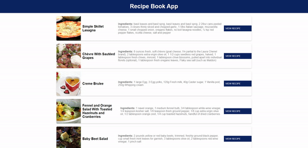

# Recipe-Book-App


<br>

## 기능  
요리 레시피를 검색할 수 있는 사이트 

<br>

## API 
https://spoonacular.com/food-api  
https://rapidapi.com/spoonacular/api/recipe-food-nutrition  


<br>

## 학습
### 1. js : map() 
배열 내의 모든 요소 각각에 대하여 주어진 함수를 호출한 결과를 모아 새로운 배열을 반환합니다.

```
const array1 = [1, 4, 9, 16];

// Pass a function to map
const map1 = array1.map((x) => x * 2);

console.log(map1);
// Expected output: Array [2, 8, 18, 32]
```

<br>

### 2. js : join() 
배열의 모든 요소를 연결해 하나의 문자열로 만듭니다.  

```
const elements = ['Fire', 'Air', 'Water'];

console.log(elements.join());
// Expected output: "Fire,Air,Water"

console.log(elements.join(''));
// Expected output: "FireAirWater"

console.log(elements.join('-'));
// Expected output: "Fire-Air-Water"
```

<br>

## 학습 출처
**유튜브**  
https://www.youtube.com/@JavaScriptKing    

**JS**  
https://developer.mozilla.org/ko/  
https://www.w3schools.com/#gsc.tab=0


**키워드**  
map()   
join()  
